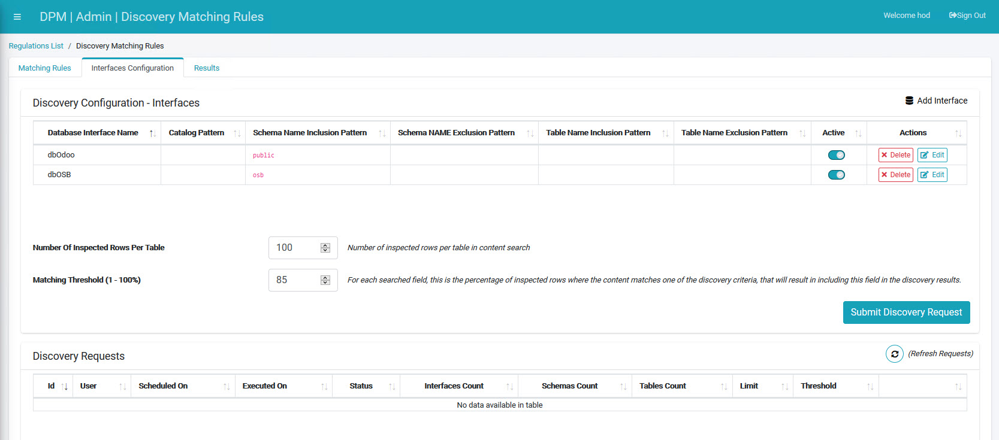

## Interfaces Configuration Tab Overview

The Interfaces Configuration tab contains options for telling the system the location of databases you want to scan. This tab has two main functions. You can tell system where the databases are that you want to scan, and you can run a scan of the databases using criteria set in the Interfaces Configuration tab.

Click the  tab. 

The Interfaces Configuration screen displays.

