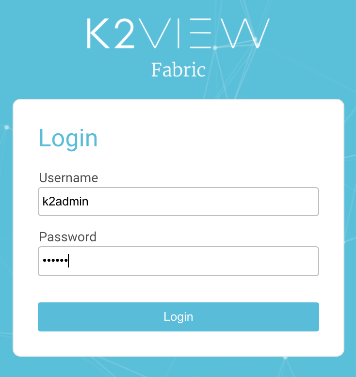

# Login to the DPM System as an Administrator

Access the DPM System login screen by using the following URL.

**URL** -  http://<your ip address>:3213/app/login

For this tutorial, enter the following credentials to access user information with an Administrator role.

**Username** - k2admin_dpm

**Password** - admin

This user is defined with the permissions of the different roles that are presented in this tutoria, so you can use it in any place where a login is requested. 

As a result, the initial screen of the Admin module displays. 
 

