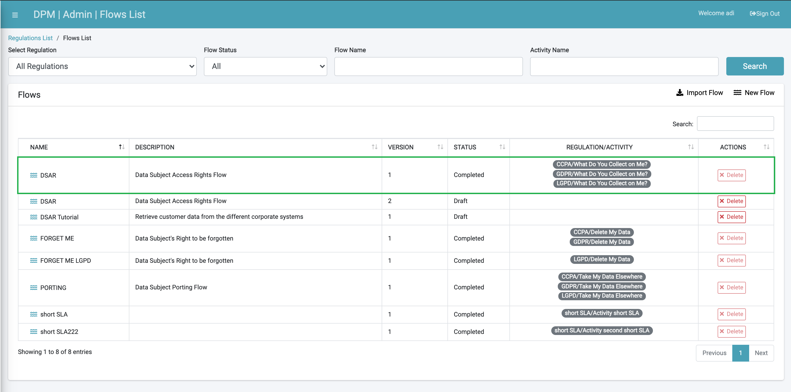
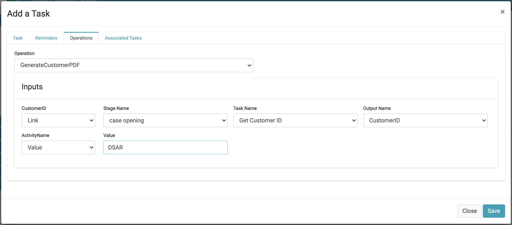
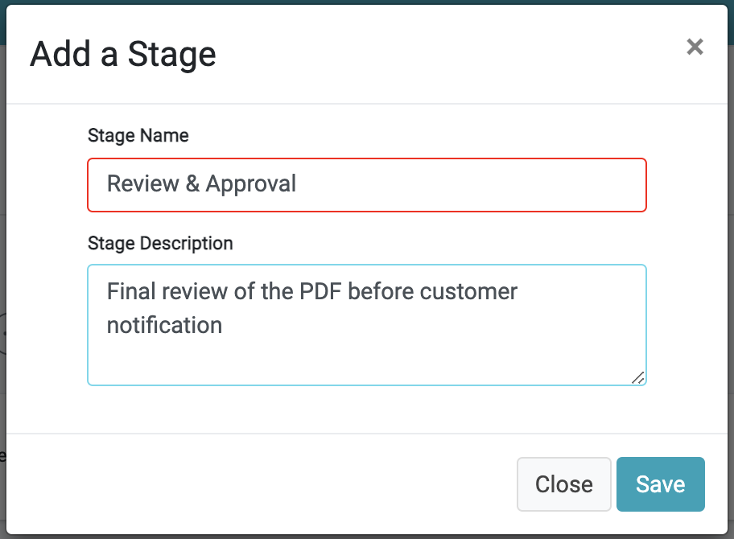
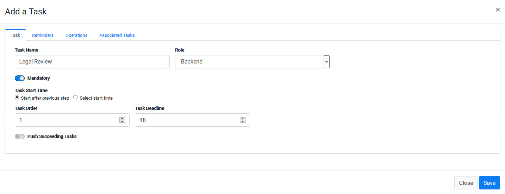
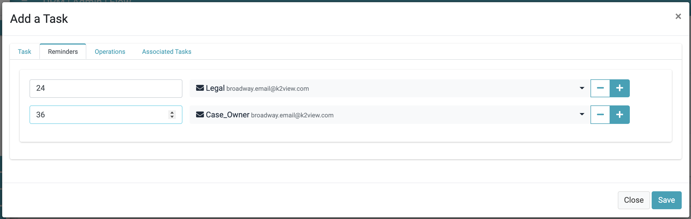
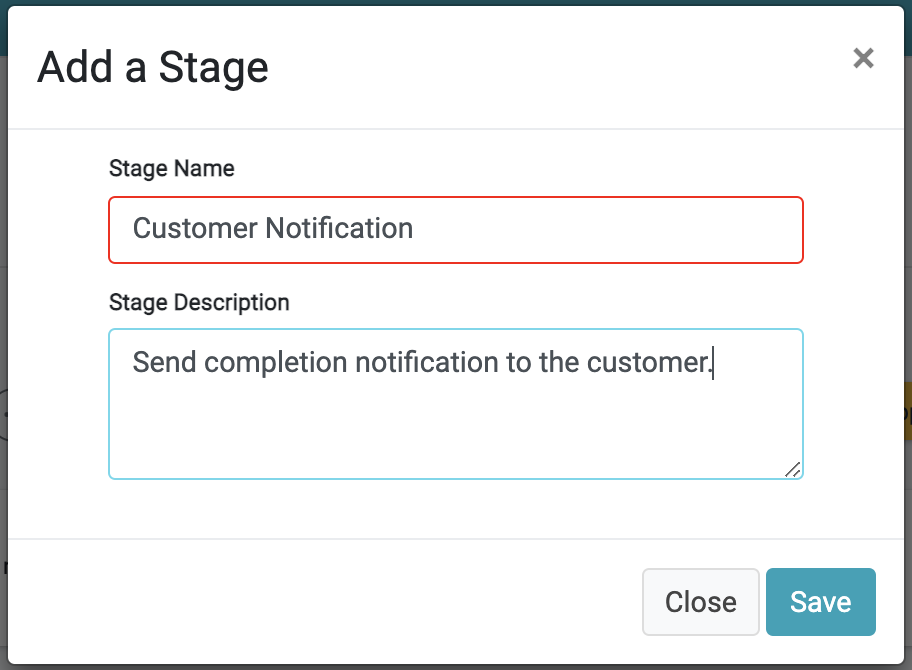
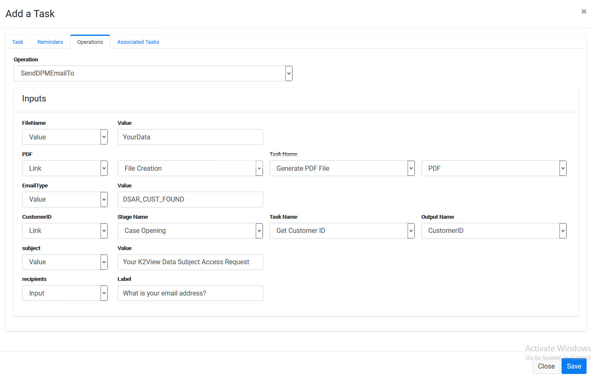
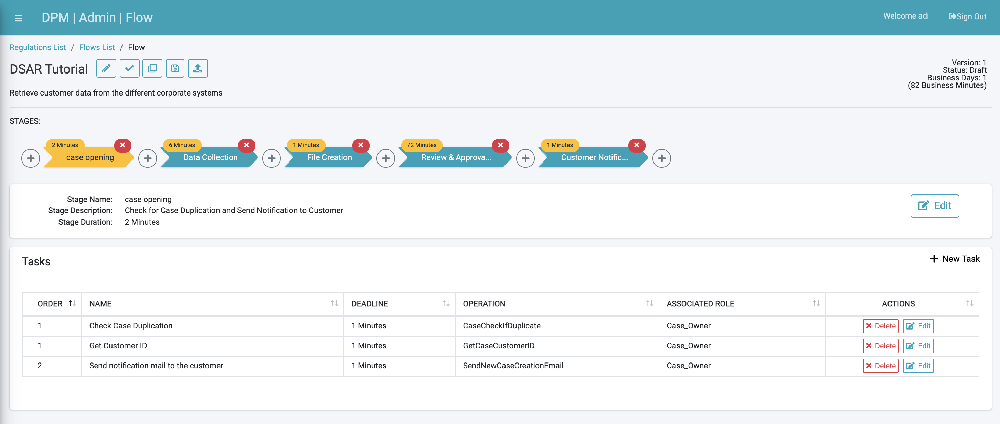

# Data Gathering and Task Review

In this tutorial, additional Stages and Tasks are created in order to complete the configuration of our DSAR Tutorial Flow. 

In addition to the steps described below, if you have any doubt you can also review the DSAR Flow implementation that comes built-in with your DPM installation.

The sample Stages we will create include: 

- **Data Collection** - This Stage is an automated task that collects customer data from the different corporate systems. In the sample implementation of this tutorial, the information is collected from Odoo and Open Source Billing systems.
- **File Generation** - Once the information is collected, an automated activity creates a PDF that includes the customer data. 
- **Review and Approval**  - Review of the resulting PDF. In our example, this review should be done by both the Legal Data Steward team and the Case Owner. 
- **Customer Notification** - After the PDF is both generated and reviewed, the Request fulfilment is completed. The customer can then be notified and delivered the results. 

### Data Collection

1. Create a new Stage called **Data Collection**.

2. Add a new Task under this Stage, called **Collect Customer Data**.

3. Click the **Operations** tab and select the **CollectCaseCustomerData** operation. This automatic operation retrieves the customer data from any integrated system. Populate the information for the customer ID field as presented in the image below.

4. Click  to save the new Task.

### File Generation

1. Add a new Stage called **File Creation**. 

2. Add a new Task under this Stage called **Generate PDF File**.

3. Click the **Operations** tab and select the **GenerateCustomerPDF** operation. This automatic operation formats the data that was collected about the customer in a PDF. 

4. Click  to save the new Task.

### Review and Approval

1. Create a new Stage called **Review & Approval**. 

2. Add a new Task under this Stage, called **Legal Review**. This is configured as a manual Task where the Legal Data Stewards team should review the PDF that was generated by the previous Task. If the PDF content meets expectations, they approve the notification that is sent to the customer.  Being a manual Task, it may take longer to complete, so adjust the **Task Deadline** according to the duration you consider reasonable. We have set it to 48 minutes in the example below. 

   Choosing a duration of 48 minutes is not accidental: in order to facilitate the testing process of your flows, the DPM system can be configured to work with different time units such as minutes or hours. During testing, you would normally use the configuration of minutes so that tests can be rapidly concluded. However, in production, you would typically use the hours configuration; therefore, the duration of the task that had 48 minutes in testing, would be of two days (48 hours) in production. 

3. Click the **Reminders** tab. Since this is a manual operation, we will also configure reminders in two intervals - one to the Legal team and the other to the Case Owner, so that if this Task is not being completed, the relevant users should be notified to take action. 

4. Click  to save the new Task.

5. Create another Task under the same Stage: **Case Owner Review**. Assign it to the **Role** of **Case_Owner**. This is also a manual Task that should be executed after the legal review is complete. Therefore, set the **Task Order** to **2**, and give it a **Task Deadline** of **24** minutes.

### 	Customer Notification

1. Create a new Stage called **Customer Notification**. 

2. Add a new Task under this Stage, called **E-mail Customer**.

3. Click the **Operations** tab and select the **SendDPMEmailTo** operation. This automatic operation will send a notification to the customer once the Request is successfully completed, and the PDF can be delivered to the customer. Configure the **Inputs** parameters as shown below. 

   Customer ID - is obtained from the task Get Customer ID from the first stage
   E-mail type - The value we use here is DSAR_CUST_FOUND, which is the e-mail layout we created for this task (personalized in your real-life implementation). 
   File Name - YourData
   PDF - link to the PDF that was created in the previous steps.
   Recipients - configured to be obtained from the customer when they submit the request. Set the label to be: **What is your email address?**
   Subject - The E-mail subject - set it to be **Your K2View Data Subject Access Request**
   

4. Click  to save the new Task.

Your DSAR Flow is now complete. The final result should look similar to the following image.

