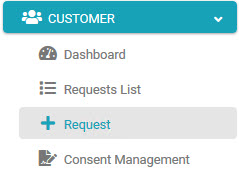

## Submit a First Request

The first action is to submit an initial DSAR Request. The data collected by this request is used to demonstrate the information DPM would collect about your customer prior to any change. 

**Note:** in the previous steps of this tutorial you may have already submitted a DSAR request for Anabelle Deleon, and recieved as a result the PDF containing the data od this customer as they are at this point at the source systems. If so, you can skip this step of the first request and move to the next Tutorial section. 

Click  under the CUSTOMER menu options, located on the left side of the screen. 

     

The New Request screen displays.

Select a Regulation from the drop-down list. For this tutorial, we will select **CCPA**.

  

Select **What Do You Collect on Me?** under the "Request Type" section.

The **What Do You Collect on Me?** Request Type under the **CCPA** Regulation displays an email address entry field. 

Complete the e-mail address requested on the right side of the form.  

     

Click  to submit the Request.

### Ensure Your Request was Marked Complete

Once the Request is submitted, the customer can access the **Requests List** using the menu option on the left of the screen and view the request progress.

**Note**: It may take a few minutes for the Request to be marked as Complete. You can follow the progress by viewing the status bar. When the status bar reaches its end and turns fully green, the Request is complete.

 

