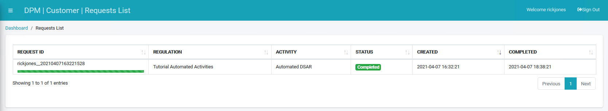

## Submit a First Request

For this tutorial, we will submit an initial Request.

Click  under the CUSTOMER menu options, located on the left side of the screen. 

     

The New Request screen displays.

Select a Regulation from the drop-down list. For this tutorial, we will select **Tutorial Automated Activities**.

  

Select **Automated DSAR** under the "Request Type" section.

The **Automated DSAR** Request Type under the **Tutorial Automated Activities** Regulation displays an email address entry field. 

**Note**: Both the type and number of fields that display under the **Request Form Fields** section of the screen depend on source system information and any options you designate for the Customer as modifiable data.

Complete the field(s) on the right side of the form.  

     

Click  to submit the Request.

### Ensure Your Request was Marked Complete

Once the Request is submitted, the customer can access the **Requests List** using the menu option on the left of the screen and view the request progress.

**Note**: It may take a few minutes for the Request to be marked as Complete. You can follow the progress by viewing the status bar. When the status bar turns green, the Request is complete.

 

