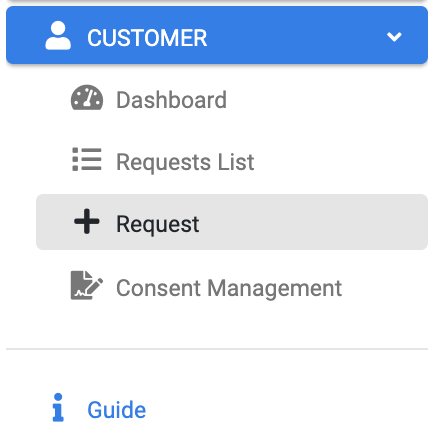
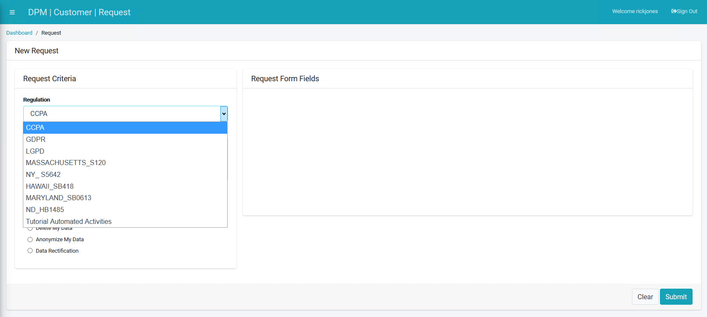
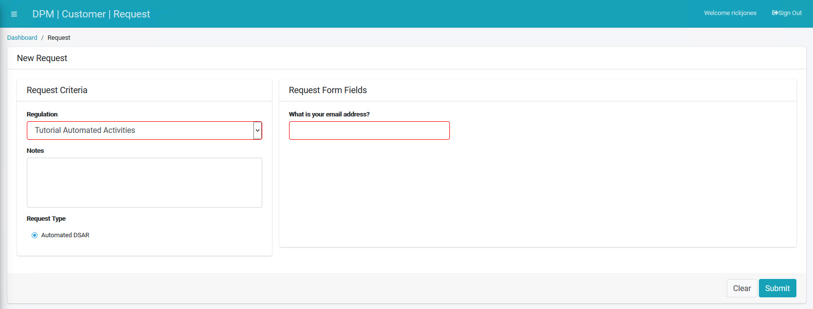
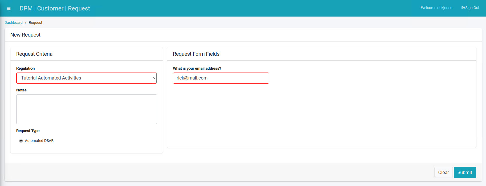

## Submit a Second Request

We will now ask you to submit a second customer Request. After submitting this Request, you will see that the changes made in the source system are synchronized with the DPM system and are included in the data collected for the second DSAR request.  

At the DPM system, click  under the CUSTOMER menu options, located on the left side of the screen. 

     

The New Request screen displays.

Select a Regulation from the drop-down list. As with our first Request, we will select **CCPA**.

  

Select **What Do You Collect on Me?** under the "Request Type" section.

The **What Do You Collect on Me?** Request Type under the **CCPA** Regulation displays an email address entry field. 

**Note**: Both the type and number of fields that display under the **Request Form Fields** section of the screen depend on source system information and any options you designate for the Customer as modifiable data.

Complete the field(s) on the right side of the form.  

     

Click  to submit the second Request.

### Ensure Your Request was Marked Complete

Once the Request is submitted, the customer can access the **Requests List** using the menu option on the left of the screen and view the request progress.

**Note**: It may take a few minutes for the Request to be marked as Complete. You can follow the progress by viewing the status bar. When the status bar reaches its end and turns fully green, the Request is complete.  

