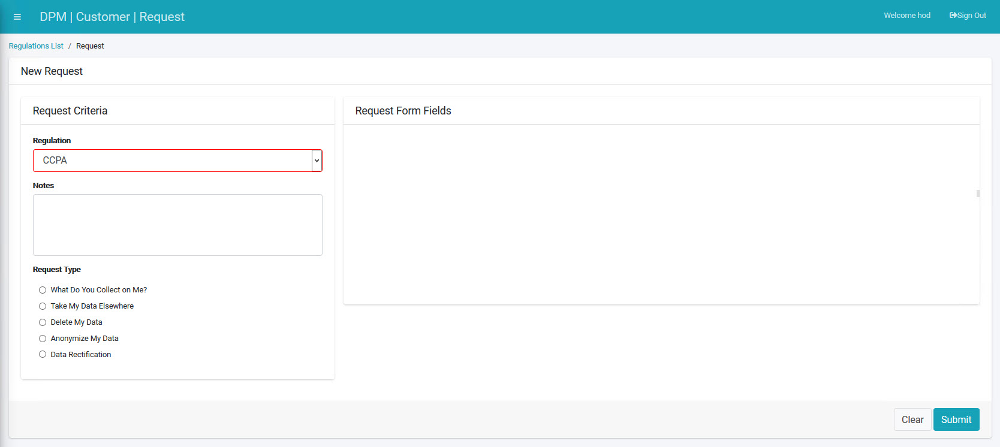

## Submit a Request to Rectify Data

When submitting a new Request, the Customer first selects the relevant Regulation from the **Regulation** dropdown list. The list of Request Types presented at the bottom of the submission form changes according to the selected Regulation. Once the **Request Type** is selected, the right side of the form displays a list of fields to complete before submitting the request. This list is automatically built, in accordance with the Request Type.

In accordance with the selected Regulation, a Customer may have the option to rectify their data in the system.

Click  under the CUSTOMER menu options, located on the left side of the screen. 

     

The New Request screen displays.

Select a Regulation from the drop-down list. For this tutorial, we will select **CCPA**.

  

Select **Data Rectification** under the "Request Type" section.

The **Data Rectification** Request Type under the **CCPA** Regulation displays both phone number and email address entry fields. The entry fields that display depend on source systems and any options you designate for the Customer as modifiable data. 

Complete the field(s) on the right side of the form.  

     

Click  to submit the request to rectify the Customer data.

