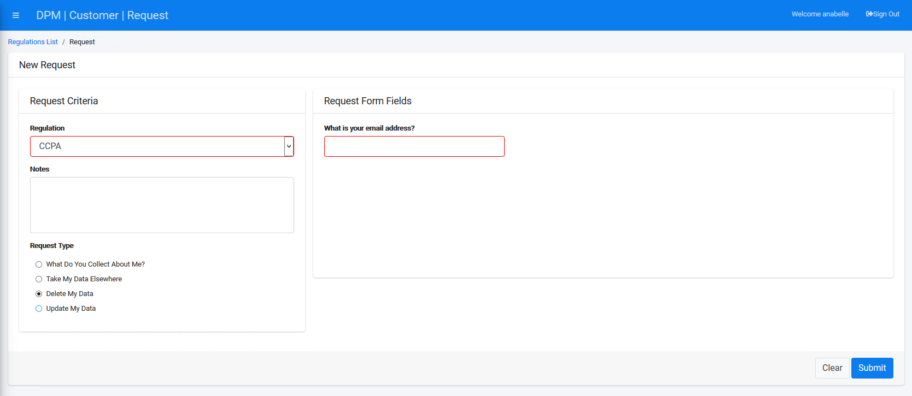

## Submit a Request to Purge Data

To submit a data purging request for this customer:
Click  under the REPRESENTATIVE menu options, located on the left side of the screen. 

    

The New Request screen displays.

 

Select a Regulation from the drop-down list. For this tutorial, we will select **CCPA**. When submitting a New Request, the Representative first selects the applicable Regulation for the customer from the Regulation dropdown list and enters the customer number in the Customer field. The Representative can also add Notes to the Request before submission.

Select **Delete My Data** under the "Request Type" section.

Complete the field(s) on the right side of the form. The **Delete My Data** Request Type under the **CCPA** Regulation displays only an email address entry field. Enter a valid email address. Confirmation of data deletion will be sent to the email address entered into this field. 

     

Click  to submit the request to delete the Customer data.

