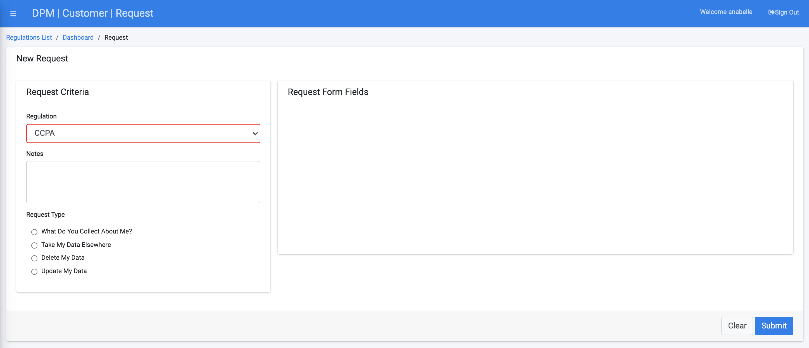

## Submit a Request to Purge Data

To submit a data purging request for this customer:
Click  under the CUSTOMER menu options, located on the left side of the screen. 

The New Request screen displays.

Select a Regulation from the drop-down list. For this tutorial, we will select **CCPA**.

  

Select **Delete My Data** under the "Request Type" section.

Complete the field(s) on the right side of the form. The **Delete My Data** Request Type under the **CCPA** Regulation displays only an email address entry field. Enter the Customer email address. Confirmation of data deletion will be sent to the email address entered into this field. 

     

Click  to submit the request to delete the Customer data.

