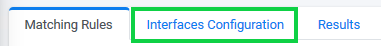

## Second Tab: Interfaces Configuration

The Interfaces Configuration tab contains options for telling the system the location of databases you want to scan. This tab has two main functions. You can tell system where the databases are that you want to scan, and you can run a scan of the databases using criteria set in the **Interfaces Configuration** tab.

### Add an Interface

Click the  tab. 

The Interfaces Configuration screen displays.

Click the  button at the top-right of the screen in order to configure a new interface. The New Discovery Interface dialog box displays. 

Select an **Interface**. This list will include all the systems with which the DPM is integrated in your company and is configured in the DPM fabric studio, as part of your project configuration.

The following example shows the **New Discovery Interface** screen populated with sample information.

For this tutorial, select **dbMySQL**.

Enter a **Catalog Pattern**. For this tutorial, enter **/^Phone**. 

Enter a **Schema Name Inclusion Pattern** if you want the discovery process to scan only tables under specific schemas. 

Enter a **Schema Name Exclusion Pattern** if you want the discovery process to ignore specific schemas.  

Enter a **Table Name Inclusion Pattern** if you want the discovery process to scan only tables with a specific name pattern.

Enter a **Table Name Exclusion Pattern** if you want the discovery process to ignore tables with a specific name pattern.

Review your entries as needed, and then click .

The New Discovery Interface displays in the Interfaces Configuration table. 

