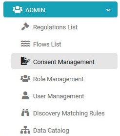

### Login to the System

To configure the Consent Topics, you should enter the DPM using the credentials of a User that has the Admin priviliges. 

For this tutorial, enter the following credentials to access user information with an Administrator role.

**Username** - demoAdmin

**Password** - k2view

This user is defined as an Administrator user. 

Click **Login**. 

As a result, the initial screen of the Admin module displays. By default, the Regulation List screen is displayed. 

Click   under the ADMIN menu options, located on the left side of the screen. 

The Consent Management screen displays.

