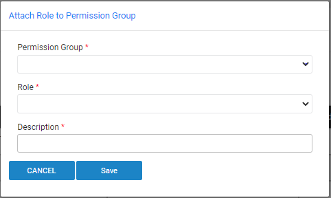

# Permission Groups Mapping Window

The **Permission Groups Mapping** window displays the mapping between Fabric roles and the [TDM Permission Groups](02_tdm_gui_user_types.md). 

Note that a the relation between Fabric roles and TDM Permission Groups is many to one, i.e. a Fabric role can be mapped to one TDM Permission Groups, but it is possible to map multiple Fabric roles into a given TDM Permission Group.

This mapping must be added by the TDM GUI setup activities and is saved in [permission_groups_mapping TDM DB table](/articles/TDM/tdm_architecture/02_tdm_database.md#permission_groups_mapping).

### Who Can Map a Fabric Role to a TDM Permissions Group?

Only [Admin users](02_tdm_gui_user_types.md#admin) can add, remove, or edit a mapping of a Fabric role to a permission group.

The TDMDB creation script inserts an initial record to **permission_groups_mapping TDM DB table** to map Fabric **admin role** to the **Admin** TDM Permission Group. This enables an admin user (attached to Fabric admin role) to populate the initial TDM Permission Groups mapping in the TDM GUI:

### How to Add a New Permission Group Mapping?

- Click the  icon on the right corner of the Permission Groups Mapping window. A popup window is opened:

- Select a Permission Group and a Fabric Role from the dropdown lists of the **Permission Group** and **Role** settings. 

- The **Description** setting is an optional setting and can be populated by a free text.

- Save the changes.

### Edit a Permission Group Mapping

Click the  icon next to the Permission Group mapping record. A popup window is opened.  Edit the Permission Group, Role, or Description settings if needed and save the changes.

### Delete a Permission Group Mapping

Click the  icon next to the Permission Group mapping record to delete the Permission Group mapping. The delete activity deletes the record from permission_groups_mapping TDM DB table.

